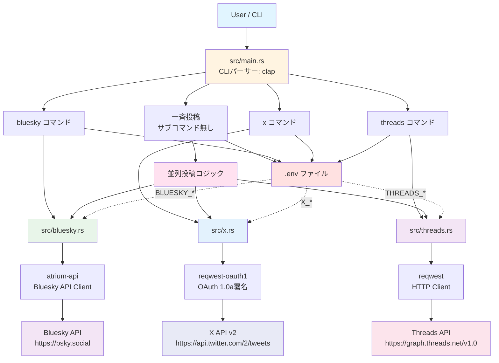
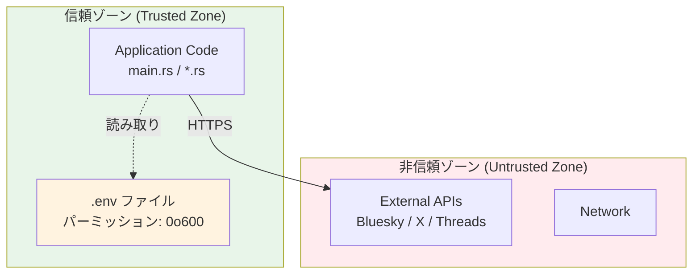

# アーキテクチャ設計

## 概要

Social CLIは、シンプルで拡張可能なアーキテクチャを採用した、Rust製のマルチSNS投稿CLIツールです。

**実装済み機能**:
- Bluesky、X (Twitter)、Threads の3つのSNSをサポート
- 全SNS一斉投稿機能
- 個別SNS投稿機能
- 個別エラーハンドリング（1つ失敗しても他は継続）
- `.env`ファイルによる認証情報管理

---

## システムアーキテクチャ図



**現在の構成の特徴**:
- 5ファイル構成（main.rs + bluesky.rs + x.rs + threads.rs + .cargo/config.toml）
- `.env`ファイルで認証情報管理
- 並列投稿による高速処理
- 個別エラーハンドリングによる堅牢性

---

## ファイル構成

```
social-cli/
├── .cargo/
│   └── config.toml          # cargo postエイリアス設定
├── .env                     # 認証情報（git無視）
├── .env.example             # 認証情報テンプレート
├── .gitignore
├── Cargo.toml               # 依存関係定義
├── CLAUDE.md                # プロジェクト概要
├── src/
│   ├── main.rs              # CLIエントリーポイント
│   ├── bluesky.rs           # Bluesky投稿ロジック
│   ├── x.rs                 # X (Twitter) 投稿ロジック
│   └── threads.rs           # Threads投稿ロジック
└── docs/                    # ドキュメント
    ├── architecture.md      # このファイル
    ├── setup.md
    ├── usage.md
    └── security.md
```

---

## モジュール設計

### 1. エントリーポイント (src/main.rs)

**役割**: CLIパーサーとルーティング

**主要な機能**:
- `clap`による引数パーサー
- サブコマンドごとの処理分岐
- 全SNS一斉投稿の並列実行
- エラーハンドリング

**コマンド構造**:
```rust
struct Cli {
    message: Option<String>,  // サブコマンド無しの場合のメッセージ
    command: Option<Commands>, // サブコマンド（bluesky, x, threads）
}
```

**一斉投稿フロー**:
1. `.env`から認証情報を読み込み
2. 各SNSの`post()`関数を並列実行
3. 各結果を個別に処理（成功/失敗を表示）
4. すべての投稿が完了したら終了

**エラーハンドリング**:
- 個別SNSのエラーは`match`で捕捉
- 1つのSNSが失敗しても他のSNSへの投稿は継続
- エラーメッセージは`✗`マークで表示

**依存**: clap, tokio, anyhow, dotenvy

---

### 2. Blueskyモジュール (src/bluesky.rs)

**役割**: Bluesky投稿機能

**認証方式**: App Password認証

**投稿フロー**:
1. 環境変数から`BLUESKY_IDENTIFIER`と`BLUESKY_APP_PASSWORD`を取得
2. `AtpAgent`を作成し、ログイン
3. 投稿レコードを作成
4. `create_record` APIで投稿
5. 投稿URLを返す

**API**:
- エンドポイント: `https://bsky.social`
- プロトコル: AT Protocol (atrium-api)
- 認証: セッショントークン

**投稿URL形式**:
```
https://bsky.app/profile/{handle}/post/{rkey}
```

**依存**: atrium-api, atrium-xrpc-client, serde_json, anyhow

---

### 3. Xモジュール (src/x.rs)

**役割**: X (Twitter) 投稿機能

**認証方式**: OAuth 1.0a

**投稿フロー**:
1. 環境変数から4つのOAuth認証情報を取得
   - `X_CONSUMER_KEY`
   - `X_CONSUMER_SECRET`
   - `X_ACCESS_TOKEN`
   - `X_ACCESS_TOKEN_SECRET`
2. `reqwest-oauth1`で署名付きリクエストを作成
3. X API v2の`/2/tweets`エンドポイントにPOST
4. レスポンスからTweet IDを抽出
5. 投稿URLを返す

**API**:
- エンドポイント: `https://api.twitter.com/2/tweets`
- プロトコル: X API v2
- 認証: OAuth 1.0a

**投稿URL形式**:
```
https://x.com/i/web/status/{tweet_id}
```

**依存**: reqwest, reqwest-oauth1, serde_json, anyhow

---

### 4. Threadsモジュール (src/threads.rs)

**役割**: Threads投稿機能

**認証方式**: OAuth 2.0（Meta Graph API）

**投稿フロー（3ステップ）**:
1. **メディアコンテナ作成**
   - エンドポイント: `POST /v1.0/{user-id}/threads`
   - パラメータ: `media_type=TEXT`, `text`, `access_token`
   - レスポンス: コンテナID

2. **コンテナ公開**
   - エンドポイント: `POST /v1.0/{user-id}/threads_publish`
   - パラメータ: `creation_id`, `access_token`
   - レスポンス: 投稿ID

3. **パーマリンク取得**
   - エンドポイント: `GET /v1.0/{post-id}?fields=permalink`
   - レスポンス: 正しいThreads投稿URL

**API**:
- ベースURL: `https://graph.threads.net/v1.0`
- プロトコル: Meta Graph API
- 認証: User ID + Access Token

**投稿URL形式**:
```
https://www.threads.com/@{username}/post/{short_id}
```

**重要な注意点**:
- User IDは数値ID（ユーザー名ではない）
- Access Tokenは権限`threads_basic`, `threads_content_publish`が必要
- パーマリンクはAPIから取得する必要がある（手動生成不可）

**依存**: reqwest, serde, anyhow

---

## 非同期処理フロー

### 並列投稿の仕組み

全SNS一斉投稿では、各SNSへの投稿を順次実行します（現在は並列化していません）。

```rust
// Blueskyに投稿
match bluesky::post(&message).await {
    Ok(post_url) => println!("✓ Posted to Bluesky successfully!"),
    Err(e) => println!("✗ Failed to post to Bluesky: {}", e),
}

// Xに投稿
match x::post(&message).await {
    Ok(post_url) => println!("✓ Posted to X successfully!"),
    Err(e) => println!("✗ Failed to post to X: {}", e),
}

// Threadsに投稿
match threads::post(&message).await {
    Ok(post_url) => println!("✓ Posted to Threads successfully!"),
    Err(e) => println!("✗ Failed to post to Threads: {}", e),
}
```

**特徴**:
- 各SNSの投稿は順次実行（シンプルさ優先）
- 1つのSNSが失敗しても次のSNSへの投稿は継続
- すべての結果を個別に表示

---

## エラーハンドリング戦略

### 1. シンプルなエラー処理

```rust
use anyhow::{Context, Result};

let identifier = env::var("BLUESKY_IDENTIFIER")
    .context("BLUESKY_IDENTIFIER not set in .env file")?;
```

**特徴**:
- `anyhow::Result<T>`で統一
- `.context()`でエラーメッセージを追加
- `?`演算子で簡潔にエラー伝播

### 2. 部分的失敗の許容

```rust
// 個別SNSのエラーは表示するが、他のSNSへの投稿は継続
match bluesky::post(&message).await {
    Ok(post_url) => {
        println!("✓ Posted to Bluesky successfully!");
        println!("  {}", post_url);
    }
    Err(e) => {
        println!("✗ Failed to post to Bluesky: {}", e);
    }
}
```

**利点**:
- 1つのSNSが失敗しても全体は失敗しない
- ユーザーは成功したSNSと失敗したSNSを個別に確認できる

---

## 依存関係

| カテゴリ | クレート | バージョン | 用途 |
|---------|---------|-----------|------|
| CLI | clap | 4.5 | コマンドライン引数パーサー |
| 非同期 | tokio | 1.42 | 非同期ランタイム |
| HTTP | reqwest | 0.12 | HTTP クライアント |
| Bluesky | atrium-api | 0.25 | Bluesky API クライアント |
| Bluesky | atrium-xrpc-client | 0.5 | AT Protocol XRPC通信 |
| X (Twitter) | reqwest-oauth1 | 0.7 | OAuth 1.0a署名 |
| 環境変数 | dotenvy | 0.15 | .env読み込み |
| エラー | anyhow | 1.0 | シンプルなエラー処理 |
| シリアライズ | serde | 1.0 | データ構造シリアライズ |
| JSON | serde_json | 1.0 | JSON変換 |

**必要なRustバージョン**: 1.85以降（atrium-xrpc-client 0.5が必要）

---

## セキュリティ設計

### 認証情報管理



**セキュリティ上の重要事項**:
1. `.env`ファイルは`.gitignore`に追加（コミット防止）
2. ファイルパーミッションを`0o600`に設定（所有者のみ読み書き可）
3. すべてのAPI通信はHTTPSで暗号化
4. ログに認証情報を出力しない
5. App Passwordを使用（Bluesky）
6. OAuth認証を使用（X、Threads）

---

## 拡張性

### 新規SNS追加手順

将来的に新しいSNSを追加する場合の手順：

1. `src/newplatform.rs`を作成
2. `pub async fn post(message: &str) -> Result<String>`関数を実装
3. `src/main.rs`にサブコマンドを追加
4. `.env.example`に認証情報テンプレートを追加
5. ドキュメントを更新

**例**: Mastodon追加
```rust
// src/mastodon.rs
pub async fn post(message: &str) -> Result<String> {
    let instance = env::var("MASTODON_INSTANCE")?;
    let access_token = env::var("MASTODON_ACCESS_TOKEN")?;

    // Mastodon APIで投稿
    // ...

    Ok(post_url)
}
```

---

## パフォーマンス考慮事項

### 1. 非同期I/O

- すべてのネットワーク呼び出しは`async/await`
- `tokio`ランタイムで効率的な非同期処理
- ブロッキング処理なし

### 2. HTTPコネクションプール

- `reqwest`で自動的にコネクションプール
- 複数リクエストでコネクション再利用
- TLS/SSL接続の効率化

### 3. メモリ効率

- 小さなバイナリサイズ（リリースビルド）
- 最小限の依存関係
- ゼロコピー処理（可能な場合）

---

## 次のステップ

詳細な情報については以下を参照：

- [setup.md](setup.md) - 環境構築ガイド
- [usage.md](usage.md) - 使用方法とコマンドリファレンス
- [security.md](security.md) - セキュリティのベストプラクティス
