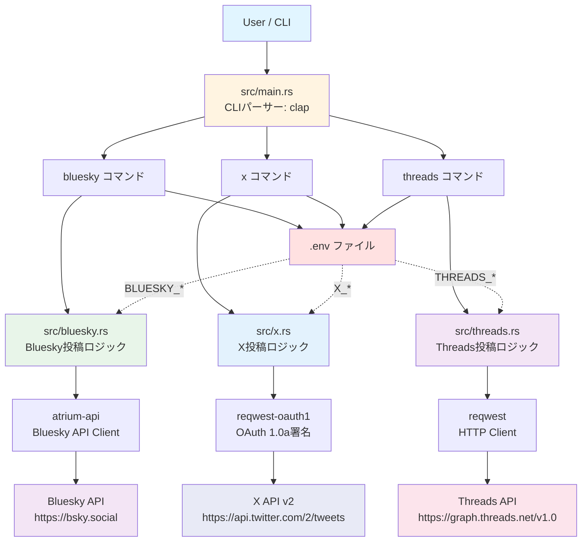
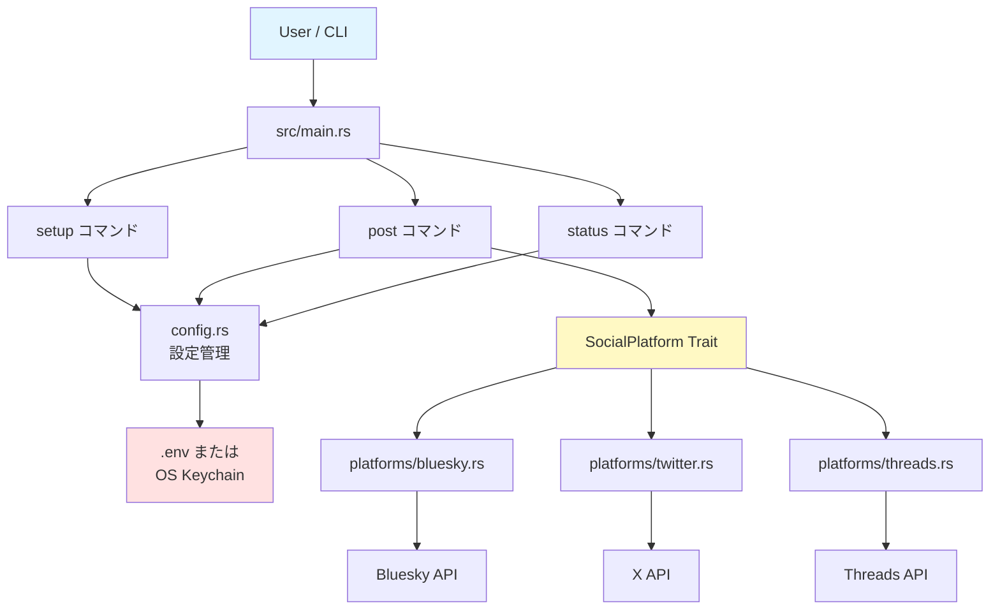
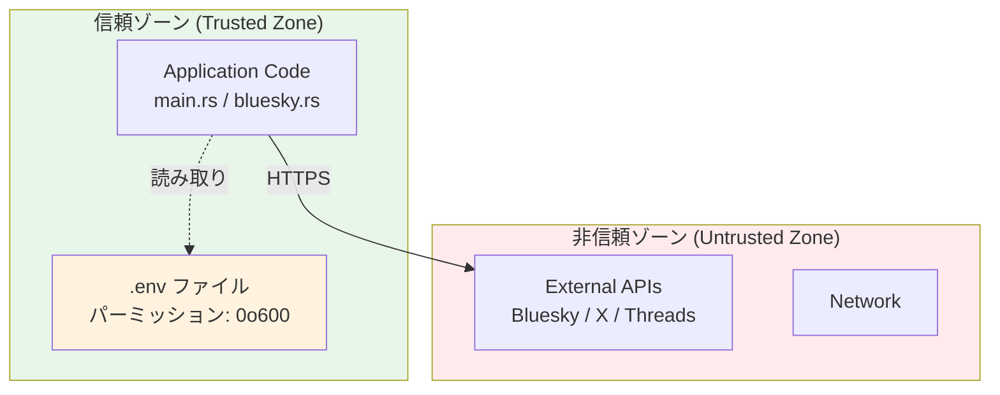

# アーキテクチャ設計

## 概要

Social CLIは、プラットフォーム抽象化レイヤーを中心とした、拡張可能なアーキテクチャを採用しています。

---

## システムアーキテクチャ図（Phase 1-3 実装済み）



**Phase 1-3 構成の特徴**:
- 4ファイル構成（main.rs + bluesky.rs + x.rs + threads.rs）
- .env ファイルで認証情報管理
- Bluesky、X (Twitter)、Threadsの3つのSNSをサポート
- 個別のサブコマンド（`bluesky`, `x`, `threads`）で投稿先を選択

### 将来のアーキテクチャ（Phase 4以降）



---

## モジュール設計

### 1. エントリーポイント (src/main.rs) - Phase 1-2 実装

**役割**: CLIパーサーとサブコマンドルーティング

**現在の実装**:
```rust
use clap::{Parser, Subcommand};
use anyhow::Result;

mod bluesky;
mod threads;
mod x;

#[derive(Parser)]
#[command(name = "social-cli")]
#[command(about = "Multi-platform social media posting CLI tool")]
struct Cli {
    #[command(subcommand)]
    command: Commands,
}

#[derive(Subcommand)]
enum Commands {
    /// Post a message to Bluesky
    Bluesky {
        #[arg(short, long)]
        message: String,
    },
    /// Post a message to X (Twitter)
    X {
        #[arg(short, long)]
        message: String,
    },
    /// Post a message to Threads
    Threads {
        #[arg(short, long)]
        message: String,
    },
}

#[tokio::main]
async fn main() -> Result<()> {
    dotenvy::dotenv().ok();
    let cli = Cli::parse();

    match cli.command {
        Commands::Bluesky { message } => {
            let post_url = bluesky::post(&message).await?;
            println!("✓ Posted to Bluesky successfully!");
            println!("View your post: {}", post_url);
            Ok(())
        }
        Commands::X { message } => {
            let post_url = x::post(&message).await?;
            println!("✓ Posted to X successfully!");
            println!("View your tweet: {}", post_url);
            Ok(())
        }
        Commands::Threads { message } => {
            let post_url = threads::post(&message).await?;
            println!("✓ Posted to Threads successfully!");
            println!("View your thread: {}", post_url);
            Ok(())
        }
    }
}
```

**依存**: clap, tokio, anyhow, dotenvy

**Phase 4以降の拡張予定**:
```rust
#[derive(Subcommand)]
enum Commands {
    Setup(SetupArgs),
    Post(PostArgs),      // 複数SNS同時投稿
    Status(StatusArgs),
    Bluesky(BlueskyArgs),
    X(XArgs),
    Threads(ThreadsArgs),
}
```

---

### 2. エラー処理 - MVP実装

**役割**: シンプルなエラーハンドリング

**現在の実装**:
- `anyhow::Result<T>` を使用
- `.context()`でエラーメッセージを追加
- `?`演算子で簡潔にエラー伝播

**例**:
```rust
use anyhow::{Context, Result};

let identifier = env::var("BLUESKY_IDENTIFIER")
    .context("BLUESKY_IDENTIFIER not set in .env file")?;
```

**Phase 2以降の拡張予定**:
- `thiserror`を使ったカスタムエラー型
- プラットフォーム固有のエラー処理
- より詳細なエラー分類

---

### 3. Blueskyモジュール (src/bluesky.rs) - MVP実装

**役割**: Bluesky投稿機能

**現在の実装**:
```rust
use anyhow::{Context, Result};
use atrium_api::agent::AtpAgent;
use atrium_api::types::string::{AtIdentifier, Datetime};
use atrium_api::types::Unknown;
use atrium_xrpc_client::reqwest::ReqwestClient;
use std::env;

/// Post a message to Bluesky
/// Returns the URL of the created post
pub async fn post(message: &str) -> Result<String> {
    // 環境変数から認証情報を取得
    let identifier = env::var("BLUESKY_IDENTIFIER")
        .context("BLUESKY_IDENTIFIER not set in .env file")?;
    let password = env::var("BLUESKY_APP_PASSWORD")
        .context("BLUESKY_APP_PASSWORD not set in .env file")?;

    // AtpAgentを作成
    let agent = AtpAgent::new(
        ReqwestClient::new("https://bsky.social"),
        atrium_api::agent::store::MemorySessionStore::default(),
    );

    // ログインしてセッション取得
    let session = agent
        .login(&identifier, &password)
        .await
        .context("Failed to authenticate with Bluesky")?;

    // 投稿レコードを作成
    let record = atrium_api::app::bsky::feed::post::RecordData {
        created_at: Datetime::now(),
        text: message.to_string(),
        // その他のフィールドは None
        embed: None,
        // ...
    };

    // Unknown型に変換
    let record_unknown: Unknown =
        serde_json::from_value(serde_json::to_value(&record)?)?;

    // 投稿を作成
    let response = agent.api.com.atproto.repo.create_record(
        // InputDataの作成
    ).await?;

    // URLを構築して返す
    let rkey = response.uri.split('/').last()
        .context("Failed to extract rkey")?;
    let post_url = format!(
        "https://bsky.app/profile/{}/post/{}",
        session.handle.as_ref(),
        rkey
    );

    Ok(post_url)
}
```

**依存**: atrium-api, atrium-xrpc-client, serde_json, anyhow

**設計のポイント**:
- シンプルな関数1つで完結
- エラーは`.context()`で詳細を追加
- 投稿URLを返して、ユーザーがすぐ確認できる

---

### 4. Xモジュール (src/x.rs) - Phase 2 実装

**役割**: X (Twitter) 投稿機能

**現在の実装**:
```rust
use anyhow::{Context, Result};
use reqwest::Client;
use reqwest_oauth1::{OAuthClientProvider, Secrets};
use serde_json::json;
use std::env;

/// Post a message to X (Twitter)
/// Returns the URL of the created tweet
pub async fn post(message: &str) -> Result<String> {
    // 環境変数から認証情報を取得
    let consumer_key = env::var("X_CONSUMER_KEY")
        .context("X_CONSUMER_KEY not set in .env file")?;
    let consumer_secret = env::var("X_CONSUMER_SECRET")
        .context("X_CONSUMER_SECRET not set in .env file")?;
    let access_token = env::var("X_ACCESS_TOKEN")
        .context("X_ACCESS_TOKEN not set in .env file")?;
    let access_token_secret = env::var("X_ACCESS_TOKEN_SECRET")
        .context("X_ACCESS_TOKEN_SECRET not set in .env file")?;

    // OAuth1 secretsを作成
    let secrets = Secrets::new(consumer_key, consumer_secret)
        .token(access_token, access_token_secret);

    // HTTPクライアント作成
    let client = Client::new();

    // ツイートペイロードを作成
    let payload = json!({ "text": message });
    let payload_str = serde_json::to_string(&payload)?;

    // X API v2エンドポイント
    let url = "https://api.twitter.com/2/tweets";

    // OAuth1署名付きPOSTリクエストを送信
    let response = client
        .oauth1(secrets)
        .post(url)
        .header("Content-Type", "application/json")
        .body(payload_str)
        .send()
        .await
        .context("Failed to send request to X API")?;

    // レスポンスをパース
    let response_json: serde_json::Value = response
        .json()
        .await
        .context("Failed to parse X API response")?;

    // Tweet IDを抽出
    let tweet_id = response_json
        .get("data")
        .and_then(|data| data.get("id"))
        .and_then(|id| id.as_str())
        .context("Failed to extract tweet ID")?;

    // URLを構築
    let tweet_url = format!("https://x.com/i/web/status/{}", tweet_id);

    Ok(tweet_url)
}
```

**依存**: reqwest, reqwest-oauth1, serde_json, anyhow

**設計のポイント**:
- OAuth 1.0a署名を`reqwest-oauth1`で自動処理
- X API v2の`/2/tweets`エンドポイントを使用
- JSONペイロードを手動で文字列化（reqwest-oauth1の制約）
- レスポンスからTweet IDを抽出してURLを構築

**認証フロー**:
1. 環境変数から4つのOAuth 1.0a認証情報を取得
2. `Secrets`オブジェクトを作成
3. `reqwest`クライアントに`.oauth1()`で署名を追加
4. X API v2にPOSTリクエスト送信

---

### 5. Threadsモジュール (src/threads.rs) - Phase 3 実装

**役割**: Threads投稿機能

**現在の実装**:
```rust
use anyhow::{Context, Result};
use reqwest::Client;
use serde::Deserialize;
use std::env;

/// Response from creating a media container
#[derive(Debug, Deserialize)]
struct CreateContainerResponse {
    id: String,
}

/// Response from publishing a thread
#[derive(Debug, Deserialize)]
struct PublishResponse {
    id: String,
}

/// Post a message to Threads
/// Returns the URL of the created thread
pub async fn post(message: &str) -> Result<String> {
    // 環境変数から認証情報を取得
    let user_id = env::var("THREADS_USER_ID")
        .context("THREADS_USER_ID not set in .env file")?;
    let access_token = env::var("THREADS_ACCESS_TOKEN")
        .context("THREADS_ACCESS_TOKEN not set in .env file")?;

    let client = Client::new();

    // Step 1: メディアコンテナを作成
    let create_url = format!("https://graph.threads.net/v1.0/{}/threads", user_id);

    let create_response = client
        .post(&create_url)
        .query(&[
            ("media_type", "TEXT"),
            ("text", message),
            ("access_token", &access_token),
        ])
        .send()
        .await
        .context("Failed to create media container")?;

    let container: CreateContainerResponse = create_response
        .json()
        .await
        .context("Failed to parse container creation response")?;

    // Step 2: コンテナを公開
    let publish_url = format!("https://graph.threads.net/v1.0/{}/threads_publish", user_id);

    let publish_response = client
        .post(&publish_url)
        .query(&[
            ("creation_id", &container.id),
            ("access_token", &access_token),
        ])
        .send()
        .await
        .context("Failed to publish thread")?;

    let publish: PublishResponse = publish_response
        .json()
        .await
        .context("Failed to parse publish response")?;

    // URLを構築
    let thread_url = format!("https://www.threads.net/@{}/post/{}", user_id, publish.id);

    Ok(thread_url)
}
```

**依存**: reqwest, serde, anyhow

**設計のポイント**:
- Threads API特有の2ステッププロセス（コンテナ作成→公開）
- OAuth 2.0認証（Meta Graph API）
- User IDとAccess Tokenで認証
- レスポンスからPost IDを抽出してURLを構築

**投稿フロー**:
1. `POST /v1.0/{user-id}/threads` でメディアコンテナ作成
   - パラメータ: `media_type=TEXT`, `text=メッセージ`, `access_token`
   - レスポンス: コンテナID
2. `POST /v1.0/{user-id}/threads_publish` でコンテナを公開
   - パラメータ: `creation_id=コンテナID`, `access_token`
   - レスポンス: 投稿ID
3. 投稿URLを返す

**認証情報**:
- `THREADS_USER_ID`: Instagram/ThreadsのユーザーID
- `THREADS_ACCESS_TOKEN`: Long-lived Access Token（60日間有効）

---

### 6. 設定管理 (Phase 4以降)

**役割**: 設定ファイルの読み書き（Phase 2以降で実装予定）

```rust
use serde::{Deserialize, Serialize};

#[derive(Debug, Serialize, Deserialize, Clone)]
pub struct Config {
    pub platforms: PlatformConfig,
}

#[derive(Debug, Serialize, Deserialize, Clone)]
pub struct PlatformConfig {
    pub bluesky: Option<BlueskyConfig>,
    pub twitter: Option<TwitterConfig>,
    pub threads: Option<ThreadsConfig>,
}

impl Config {
    /// 設定ファイルパス取得
    pub fn config_path() -> Result<PathBuf> {
        let proj_dirs = ProjectDirs::from("com", "social-cli", "social-cli")
            .ok_or_else(|| SocialCliError::ConfigError(
                "Cannot determine config directory".into()
            ))?;
        Ok(proj_dirs.config_dir().join("config.toml"))
    }

    /// 設定読み込み
    pub fn load() -> Result<Self> {
        let path = Self::config_path()?;
        if !path.exists() {
            return Ok(Self::default());
        }

        let content = fs::read_to_string(&path)?;
        let config: Config = toml::from_str(&content)?;
        Ok(config)
    }

    /// 設定保存
    pub fn save(&self) -> Result<()> {
        let path = Self::config_path()?;
        let content = toml::to_string_pretty(self)?;

        // ディレクトリ作成
        if let Some(parent) = path.parent() {
            fs::create_dir_all(parent)?;
        }

        // ファイル書き込み
        fs::write(&path, content)?;

        // パーミッション設定 (Unix系)
        #[cfg(unix)]
        {
            use std::os::unix::fs::PermissionsExt;
            let mut perms = fs::metadata(&path)?.permissions();
            perms.set_mode(0o600); // rw-------
            fs::set_permissions(&path, perms)?;
        }

        Ok(())
    }
}
```

**設定ファイルパス**:
- Unix/macOS: `~/.config/social-cli/config.toml`
- Windows: `%APPDATA%\social-cli\config.toml`

**セキュリティ**:
- パーミッション: `0o600` (所有者のみ読み書き)
- 認証情報は含めない（キーチェーンに保存）

---

### 4. プラットフォーム抽象化 (src/platforms/traits.rs)

**役割**: SNSプラットフォームの共通インターフェース定義

```rust
use async_trait::async_trait;
use crate::error::Result;
use chrono::{DateTime, Utc};

#[async_trait]
pub trait SocialPlatform: Send + Sync {
    /// プラットフォーム名を取得
    fn name(&self) -> &'static str;

    /// 認証状態を確認
    async fn verify_credentials(&self) -> Result<bool>;

    /// テキスト投稿
    async fn post_text(&self, message: &str) -> Result<PostResponse>;

    /// 投稿可能な最大文字数を取得
    fn max_message_length(&self) -> usize;
}

#[derive(Debug, Clone)]
pub struct PostResponse {
    pub platform: String,
    pub post_id: String,
    pub url: Option<String>,
    pub timestamp: DateTime<Utc>,
}
```

**設計原則**:
- `async_trait`で非同期trait
- `Send + Sync`でスレッドセーフ
- 将来の拡張性を考慮（画像投稿等は後で追加）

---

### 5. Bluesky実装 (src/platforms/bluesky.rs)

**役割**: Bluesky API クライアント

```rust
use atrium_api::client::AtpServiceClient;
use atrium_api::types::string::AtIdentifier;
use atrium_xrpc_client::reqwest::ReqwestClient;

pub struct BlueskyClient {
    identifier: String,
    password: String,
    client: Option<AtpServiceClient<ReqwestClient>>,
}

impl BlueskyClient {
    pub fn new(identifier: String, password: String) -> Self {
        Self {
            identifier,
            password,
            client: None,
        }
    }

    /// セッション作成・認証
    pub async fn authenticate(&mut self) -> Result<()> {
        let client = AtpServiceClient::new(
            ReqwestClient::new("https://bsky.social")
        );

        // createSessionでログイン
        let session = client.service.com.atproto.server
            .create_session(CreateSessionInput {
                identifier: self.identifier.clone().into(),
                password: self.password.clone(),
            })
            .await
            .map_err(|e| SocialCliError::AuthError(e.to_string()))?;

        // セッショントークンを保存
        self.client = Some(client);
        Ok(())
    }
}

#[async_trait]
impl SocialPlatform for BlueskyClient {
    fn name(&self) -> &'static str {
        "Bluesky"
    }

    async fn verify_credentials(&self) -> Result<bool> {
        // getProfileで認証確認
        // 実装省略
        Ok(true)
    }

    async fn post_text(&self, message: &str) -> Result<PostResponse> {
        let client = self.client.as_ref()
            .ok_or_else(|| SocialCliError::AuthError(
                "Not authenticated".into()
            ))?;

        // create_recordでポスト作成
        // 実装詳細は省略

        Ok(PostResponse {
            platform: "Bluesky".to_string(),
            post_id: "...".to_string(),
            url: Some(format!("https://bsky.app/profile/{}/post/{}",
                self.identifier, "...")),
            timestamp: Utc::now(),
        })
    }

    fn max_message_length(&self) -> usize {
        300
    }
}
```

---

### 6. 認証情報管理 (src/utils/keyring.rs)

**役割**: OSキーチェーンでの認証情報保存

```rust
use keyring::Entry;
use crate::error::Result;

const SERVICE_NAME: &str = "social-cli";

/// Bluesky App Password を保存
pub fn save_bluesky_password(identifier: &str, password: &str) -> Result<()> {
    let entry = Entry::new(SERVICE_NAME, &format!("bluesky:{}", identifier))?;
    entry.set_password(password)?;
    Ok(())
}

/// Bluesky App Password を取得
pub fn get_bluesky_password(identifier: &str) -> Result<String> {
    let entry = Entry::new(SERVICE_NAME, &format!("bluesky:{}", identifier))?;
    Ok(entry.get_password()?)
}

/// 認証情報を削除
pub fn delete_bluesky_password(identifier: &str) -> Result<()> {
    let entry = Entry::new(SERVICE_NAME, &format!("bluesky:{}", identifier))?;
    entry.delete_password()?;
    Ok(())
}
```

**対応OS**:
- macOS: Keychain
- Windows: Credential Manager
- Linux: Secret Service (libsecret)

---

### 7. コマンド実装 (src/commands/)

#### commands/post.rs

**役割**: 投稿ロジック

```rust
pub struct PostArgs {
    #[arg(short, long)]
    message: String,

    #[arg(short, long, default_value = "all")]
    platform: String,
}

pub async fn run(args: PostArgs) -> Result<()> {
    let config = Config::load()?;

    // 有効なプラットフォームクライアントを構築
    let mut clients: Vec<Box<dyn SocialPlatform>> = Vec::new();

    // Blueskyクライアント初期化
    if should_post_to("bluesky", &args.platform) {
        if let Some(ref bs_config) = config.platforms.bluesky {
            if bs_config.enabled {
                let password = keyring::get_bluesky_password(
                    &bs_config.identifier
                )?;
                let mut client = BlueskyClient::new(
                    bs_config.identifier.clone(),
                    password
                );
                client.authenticate().await?;
                clients.push(Box::new(client));
            }
        }
    }

    // 並列投稿
    let post_futures = clients.iter().map(|client| {
        let message = args.message.clone();
        async move {
            client.post_text(&message).await
        }
    });

    let results = join_all(post_futures).await;

    // 結果表示
    for (i, result) in results.into_iter().enumerate() {
        match result {
            Ok(response) => {
                println!("✓ {} - Posted successfully", response.platform);
                if let Some(url) = response.url {
                    println!("  URL: {}", url);
                }
            }
            Err(e) => {
                eprintln!("✗ Platform {} - Failed: {}", i, e);
            }
        }
    }

    Ok(())
}
```

---

## 非同期処理フロー

### 並列投稿の仕組み

```rust
// 各プラットフォームへの投稿を並列実行
let post_futures = clients.iter().map(|client| async move {
    client.post_text(message).await
});

// すべての Future を同時実行
let results = join_all(post_futures).await;
```

**利点**:
- 複数SNSへの投稿を並行処理で高速化
- 一つのSNSが失敗しても他は継続

---

## エラーハンドリング戦略

### 1. 階層的エラー処理

```
User Error (表示用)
    ↑
SocialCliError (カスタムエラー)
    ↑
Platform Specific Error (各APIのエラー)
```

### 2. 部分的失敗の許容

```rust
// 投稿結果を個別に処理
let success_count = results.iter().filter(|r| r.is_ok()).count();
println!("Summary: {}/{} posts succeeded", success_count, total);

// 一部でも成功していればOK
if success_count > 0 {
    Ok(())
} else {
    Err(SocialCliError::ApiError { ... })
}
```

### 3. リトライロジック（将来実装）

```rust
async fn post_with_retry(
    client: &dyn SocialPlatform,
    message: &str,
    max_retries: usize,
) -> Result<PostResponse> {
    for attempt in 1..=max_retries {
        match client.post_text(message).await {
            Ok(response) => return Ok(response),
            Err(e) if should_retry(&e) => {
                tokio::time::sleep(Duration::from_secs(2_u64.pow(attempt as u32))).await;
            }
            Err(e) => return Err(e),
        }
    }
    Err(SocialCliError::ApiError { ... })
}
```

---

## 拡張性

### 新規プラットフォーム追加手順

1. `src/platforms/newplatform.rs` 作成
2. `SocialPlatform` trait を実装
3. `src/platforms/mod.rs` に追加
4. `src/config.rs` に設定構造体追加
5. `src/commands/setup.rs` にセットアップロジック追加
6. `src/commands/post.rs` に初期化ロジック追加

**例**: Threads追加

```rust
// src/platforms/threads.rs
pub struct ThreadsClient {
    access_token: String,
}

#[async_trait]
impl SocialPlatform for ThreadsClient {
    fn name(&self) -> &'static str {
        "Threads"
    }

    async fn verify_credentials(&self) -> Result<bool> {
        // Meta Graph API で認証確認
    }

    async fn post_text(&self, message: &str) -> Result<PostResponse> {
        // Threads API で投稿
    }

    fn max_message_length(&self) -> usize {
        500
    }
}
```

---

## パフォーマンス考慮事項

### 1. 非同期I/O

- すべてのネットワーク呼び出しは`async/await`
- `tokio`ランタイムで効率的な並行処理

### 2. 設定ファイルキャッシュ

- 起動時に一度だけ読み込み
- 実行中は不変（イミュータブル）

### 3. HTTPコネクションプール

- `reqwest`で自動的にコネクションプール
- 複数リクエストでコネクション再利用

---

## テスタビリティ

### モック実装

```rust
#[cfg(test)]
pub struct MockPlatform {
    should_fail: bool,
}

#[async_trait]
impl SocialPlatform for MockPlatform {
    fn name(&self) -> &'static str {
        "Mock"
    }

    async fn verify_credentials(&self) -> Result<bool> {
        Ok(!self.should_fail)
    }

    async fn post_text(&self, _message: &str) -> Result<PostResponse> {
        if self.should_fail {
            Err(SocialCliError::ApiError {
                platform: "Mock".to_string(),
                message: "Simulated failure".to_string(),
            })
        } else {
            Ok(PostResponse {
                platform: "Mock".to_string(),
                post_id: "mock123".to_string(),
                url: None,
                timestamp: Utc::now(),
            })
        }
    }

    fn max_message_length(&self) -> usize {
        280
    }
}
```

---

## 依存関係グラフ

```
main.rs
  └─> commands/{setup, post, status}
       ├─> config.rs
       │    └─> utils/keyring.rs
       └─> platforms/traits.rs
            └─> platforms/{bluesky, twitter, threads}
                 └─> External APIs
```

---

## セキュリティ境界



**セキュリティ上の重要事項**:
- `.env` ファイルは必ず `.gitignore` に追加
- ファイルパーミッションを `0o600` (所有者のみ読み書き可) に設定
- すべてのAPI通信はHTTPSで暗号化
- ログに認証情報を出力しない

---

## 次のステップ

詳細な実装については以下を参照：

- [setup.md](setup.md) - セットアップ手順
- [api-integration.md](api-integration.md) - API統合詳細
- [security.md](security.md) - セキュリティ考慮事項
