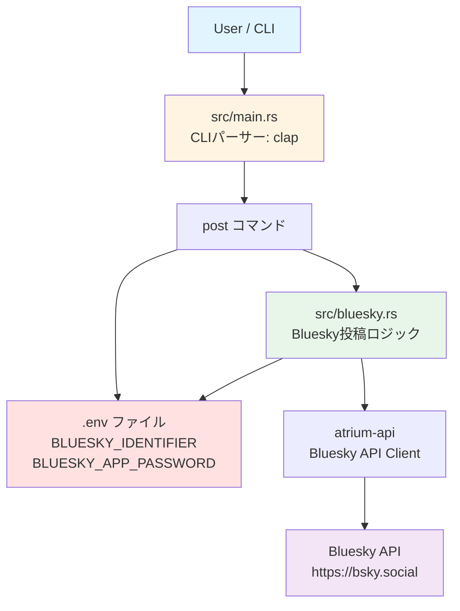

# アーキテクチャ設計

## 概要

Social CLIは、プラットフォーム抽象化レイヤーを中心とした、拡張可能なアーキテクチャを採用しています。

---

## システムアーキテクチャ図（MVP）



**MVP構成の特徴**:
- シンプルな2ファイル構成（main.rs + bluesky.rs）
- .env ファイルで認証情報管理
- Bluesky のみサポート（Phase 1）

### 将来のアーキテクチャ（Phase 2以降）


---

## モジュール設計

### 1. エントリーポイント (src/main.rs)

**役割**: CLIパーサーとサブコマンドルーティング

```rust
#[derive(Parser)]
struct Cli {
    #[command(subcommand)]
    command: Commands,
}

#[derive(Subcommand)]
enum Commands {
    Setup(SetupArgs),
    Post(PostArgs),
    Status(StatusArgs),
}

#[tokio::main]
async fn main() -> Result<()> {
    let cli = Cli::parse();
    match cli.command {
        Commands::Setup(args) => commands::setup::run(args).await,
        Commands::Post(args) => commands::post::run(args).await,
        Commands::Status(args) => commands::status::run(args).await,
    }
}
```

**依存**: clap, tokio

---

### 2. エラー処理 (src/error.rs)

**役割**: カスタムエラー型定義と変換

```rust
use thiserror::Error;

#[derive(Error, Debug)]
pub enum SocialCliError {
    #[error("Configuration error: {0}")]
    ConfigError(String),

    #[error("Authentication error: {0}")]
    AuthError(String),

    #[error("API error ({platform}): {message}")]
    ApiError {
        platform: String,
        message: String,
    },

    #[error("Network error: {0}")]
    NetworkError(#[from] reqwest::Error),

    #[error("IO error: {0}")]
    IoError(#[from] std::io::Error),

    #[error("Serialization error: {0}")]
    SerializationError(#[from] serde_json::Error),

    #[error("Keyring error: {0}")]
    KeyringError(#[from] keyring::Error),
}

pub type Result<T> = std::result::Result<T, SocialCliError>;
```

**設計原則**:
- すべてのエラーは`SocialCliError`に変換
- `thiserror`でボイラープレート削減
- `From` traitで自動変換

---

### 3. 設定管理 (src/config.rs)

**役割**: 設定ファイルの読み書き

```rust
use serde::{Deserialize, Serialize};

#[derive(Debug, Serialize, Deserialize, Clone)]
pub struct Config {
    pub platforms: PlatformConfig,
}

#[derive(Debug, Serialize, Deserialize, Clone)]
pub struct PlatformConfig {
    pub bluesky: Option<BlueskyConfig>,
    pub twitter: Option<TwitterConfig>,
    pub threads: Option<ThreadsConfig>,
}

impl Config {
    /// 設定ファイルパス取得
    pub fn config_path() -> Result<PathBuf> {
        let proj_dirs = ProjectDirs::from("com", "social-cli", "social-cli")
            .ok_or_else(|| SocialCliError::ConfigError(
                "Cannot determine config directory".into()
            ))?;
        Ok(proj_dirs.config_dir().join("config.toml"))
    }

    /// 設定読み込み
    pub fn load() -> Result<Self> {
        let path = Self::config_path()?;
        if !path.exists() {
            return Ok(Self::default());
        }

        let content = fs::read_to_string(&path)?;
        let config: Config = toml::from_str(&content)?;
        Ok(config)
    }

    /// 設定保存
    pub fn save(&self) -> Result<()> {
        let path = Self::config_path()?;
        let content = toml::to_string_pretty(self)?;

        // ディレクトリ作成
        if let Some(parent) = path.parent() {
            fs::create_dir_all(parent)?;
        }

        // ファイル書き込み
        fs::write(&path, content)?;

        // パーミッション設定 (Unix系)
        #[cfg(unix)]
        {
            use std::os::unix::fs::PermissionsExt;
            let mut perms = fs::metadata(&path)?.permissions();
            perms.set_mode(0o600); // rw-------
            fs::set_permissions(&path, perms)?;
        }

        Ok(())
    }
}
```

**設定ファイルパス**:
- Unix/macOS: `~/.config/social-cli/config.toml`
- Windows: `%APPDATA%\social-cli\config.toml`

**セキュリティ**:
- パーミッション: `0o600` (所有者のみ読み書き)
- 認証情報は含めない（キーチェーンに保存）

---

### 4. プラットフォーム抽象化 (src/platforms/traits.rs)

**役割**: SNSプラットフォームの共通インターフェース定義

```rust
use async_trait::async_trait;
use crate::error::Result;
use chrono::{DateTime, Utc};

#[async_trait]
pub trait SocialPlatform: Send + Sync {
    /// プラットフォーム名を取得
    fn name(&self) -> &'static str;

    /// 認証状態を確認
    async fn verify_credentials(&self) -> Result<bool>;

    /// テキスト投稿
    async fn post_text(&self, message: &str) -> Result<PostResponse>;

    /// 投稿可能な最大文字数を取得
    fn max_message_length(&self) -> usize;
}

#[derive(Debug, Clone)]
pub struct PostResponse {
    pub platform: String,
    pub post_id: String,
    pub url: Option<String>,
    pub timestamp: DateTime<Utc>,
}
```

**設計原則**:
- `async_trait`で非同期trait
- `Send + Sync`でスレッドセーフ
- 将来の拡張性を考慮（画像投稿等は後で追加）

---

### 5. Bluesky実装 (src/platforms/bluesky.rs)

**役割**: Bluesky API クライアント

```rust
use atrium_api::client::AtpServiceClient;
use atrium_api::types::string::AtIdentifier;
use atrium_xrpc_client::reqwest::ReqwestClient;

pub struct BlueskyClient {
    identifier: String,
    password: String,
    client: Option<AtpServiceClient<ReqwestClient>>,
}

impl BlueskyClient {
    pub fn new(identifier: String, password: String) -> Self {
        Self {
            identifier,
            password,
            client: None,
        }
    }

    /// セッション作成・認証
    pub async fn authenticate(&mut self) -> Result<()> {
        let client = AtpServiceClient::new(
            ReqwestClient::new("https://bsky.social")
        );

        // createSessionでログイン
        let session = client.service.com.atproto.server
            .create_session(CreateSessionInput {
                identifier: self.identifier.clone().into(),
                password: self.password.clone(),
            })
            .await
            .map_err(|e| SocialCliError::AuthError(e.to_string()))?;

        // セッショントークンを保存
        self.client = Some(client);
        Ok(())
    }
}

#[async_trait]
impl SocialPlatform for BlueskyClient {
    fn name(&self) -> &'static str {
        "Bluesky"
    }

    async fn verify_credentials(&self) -> Result<bool> {
        // getProfileで認証確認
        // 実装省略
        Ok(true)
    }

    async fn post_text(&self, message: &str) -> Result<PostResponse> {
        let client = self.client.as_ref()
            .ok_or_else(|| SocialCliError::AuthError(
                "Not authenticated".into()
            ))?;

        // create_recordでポスト作成
        // 実装詳細は省略

        Ok(PostResponse {
            platform: "Bluesky".to_string(),
            post_id: "...".to_string(),
            url: Some(format!("https://bsky.app/profile/{}/post/{}",
                self.identifier, "...")),
            timestamp: Utc::now(),
        })
    }

    fn max_message_length(&self) -> usize {
        300
    }
}
```

---

### 6. 認証情報管理 (src/utils/keyring.rs)

**役割**: OSキーチェーンでの認証情報保存

```rust
use keyring::Entry;
use crate::error::Result;

const SERVICE_NAME: &str = "social-cli";

/// Bluesky App Password を保存
pub fn save_bluesky_password(identifier: &str, password: &str) -> Result<()> {
    let entry = Entry::new(SERVICE_NAME, &format!("bluesky:{}", identifier))?;
    entry.set_password(password)?;
    Ok(())
}

/// Bluesky App Password を取得
pub fn get_bluesky_password(identifier: &str) -> Result<String> {
    let entry = Entry::new(SERVICE_NAME, &format!("bluesky:{}", identifier))?;
    Ok(entry.get_password()?)
}

/// 認証情報を削除
pub fn delete_bluesky_password(identifier: &str) -> Result<()> {
    let entry = Entry::new(SERVICE_NAME, &format!("bluesky:{}", identifier))?;
    entry.delete_password()?;
    Ok(())
}
```

**対応OS**:
- macOS: Keychain
- Windows: Credential Manager
- Linux: Secret Service (libsecret)

---

### 7. コマンド実装 (src/commands/)

#### commands/post.rs

**役割**: 投稿ロジック

```rust
pub struct PostArgs {
    #[arg(short, long)]
    message: String,

    #[arg(short, long, default_value = "all")]
    platform: String,
}

pub async fn run(args: PostArgs) -> Result<()> {
    let config = Config::load()?;

    // 有効なプラットフォームクライアントを構築
    let mut clients: Vec<Box<dyn SocialPlatform>> = Vec::new();

    // Blueskyクライアント初期化
    if should_post_to("bluesky", &args.platform) {
        if let Some(ref bs_config) = config.platforms.bluesky {
            if bs_config.enabled {
                let password = keyring::get_bluesky_password(
                    &bs_config.identifier
                )?;
                let mut client = BlueskyClient::new(
                    bs_config.identifier.clone(),
                    password
                );
                client.authenticate().await?;
                clients.push(Box::new(client));
            }
        }
    }

    // 並列投稿
    let post_futures = clients.iter().map(|client| {
        let message = args.message.clone();
        async move {
            client.post_text(&message).await
        }
    });

    let results = join_all(post_futures).await;

    // 結果表示
    for (i, result) in results.into_iter().enumerate() {
        match result {
            Ok(response) => {
                println!("✓ {} - Posted successfully", response.platform);
                if let Some(url) = response.url {
                    println!("  URL: {}", url);
                }
            }
            Err(e) => {
                eprintln!("✗ Platform {} - Failed: {}", i, e);
            }
        }
    }

    Ok(())
}
```

---

## 非同期処理フロー

### 並列投稿の仕組み

```rust
// 各プラットフォームへの投稿を並列実行
let post_futures = clients.iter().map(|client| async move {
    client.post_text(message).await
});

// すべての Future を同時実行
let results = join_all(post_futures).await;
```

**利点**:
- 複数SNSへの投稿を並行処理で高速化
- 一つのSNSが失敗しても他は継続

---

## エラーハンドリング戦略

### 1. 階層的エラー処理

```
User Error (表示用)
    ↑
SocialCliError (カスタムエラー)
    ↑
Platform Specific Error (各APIのエラー)
```

### 2. 部分的失敗の許容

```rust
// 投稿結果を個別に処理
let success_count = results.iter().filter(|r| r.is_ok()).count();
println!("Summary: {}/{} posts succeeded", success_count, total);

// 一部でも成功していればOK
if success_count > 0 {
    Ok(())
} else {
    Err(SocialCliError::ApiError { ... })
}
```

### 3. リトライロジック（将来実装）

```rust
async fn post_with_retry(
    client: &dyn SocialPlatform,
    message: &str,
    max_retries: usize,
) -> Result<PostResponse> {
    for attempt in 1..=max_retries {
        match client.post_text(message).await {
            Ok(response) => return Ok(response),
            Err(e) if should_retry(&e) => {
                tokio::time::sleep(Duration::from_secs(2_u64.pow(attempt as u32))).await;
            }
            Err(e) => return Err(e),
        }
    }
    Err(SocialCliError::ApiError { ... })
}
```

---

## 拡張性

### 新規プラットフォーム追加手順

1. `src/platforms/newplatform.rs` 作成
2. `SocialPlatform` trait を実装
3. `src/platforms/mod.rs` に追加
4. `src/config.rs` に設定構造体追加
5. `src/commands/setup.rs` にセットアップロジック追加
6. `src/commands/post.rs` に初期化ロジック追加

**例**: Threads追加

```rust
// src/platforms/threads.rs
pub struct ThreadsClient {
    access_token: String,
}

#[async_trait]
impl SocialPlatform for ThreadsClient {
    fn name(&self) -> &'static str {
        "Threads"
    }

    async fn verify_credentials(&self) -> Result<bool> {
        // Meta Graph API で認証確認
    }

    async fn post_text(&self, message: &str) -> Result<PostResponse> {
        // Threads API で投稿
    }

    fn max_message_length(&self) -> usize {
        500
    }
}
```

---

## パフォーマンス考慮事項

### 1. 非同期I/O

- すべてのネットワーク呼び出しは`async/await`
- `tokio`ランタイムで効率的な並行処理

### 2. 設定ファイルキャッシュ

- 起動時に一度だけ読み込み
- 実行中は不変（イミュータブル）

### 3. HTTPコネクションプール

- `reqwest`で自動的にコネクションプール
- 複数リクエストでコネクション再利用

---

## テスタビリティ

### モック実装

```rust
#[cfg(test)]
pub struct MockPlatform {
    should_fail: bool,
}

#[async_trait]
impl SocialPlatform for MockPlatform {
    fn name(&self) -> &'static str {
        "Mock"
    }

    async fn verify_credentials(&self) -> Result<bool> {
        Ok(!self.should_fail)
    }

    async fn post_text(&self, _message: &str) -> Result<PostResponse> {
        if self.should_fail {
            Err(SocialCliError::ApiError {
                platform: "Mock".to_string(),
                message: "Simulated failure".to_string(),
            })
        } else {
            Ok(PostResponse {
                platform: "Mock".to_string(),
                post_id: "mock123".to_string(),
                url: None,
                timestamp: Utc::now(),
            })
        }
    }

    fn max_message_length(&self) -> usize {
        280
    }
}
```

---

## 依存関係グラフ

```
main.rs
  └─> commands/{setup, post, status}
       ├─> config.rs
       │    └─> utils/keyring.rs
       └─> platforms/traits.rs
            └─> platforms/{bluesky, twitter, threads}
                 └─> External APIs
```

---

## セキュリティ境界


**セキュリティ上の重要事項**:
- `.env` ファイルは必ず `.gitignore` に追加
- ファイルパーミッションを `0o600` (所有者のみ読み書き可) に設定
- すべてのAPI通信はHTTPSで暗号化
- ログに認証情報を出力しない

---

## 次のステップ

詳細な実装については以下を参照：

- [setup.md](setup.md) - セットアップ手順
- [api-integration.md](api-integration.md) - API統合詳細
- [security.md](security.md) - セキュリティ考慮事項
